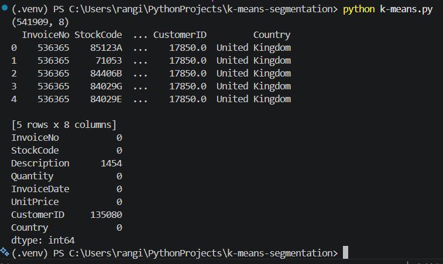
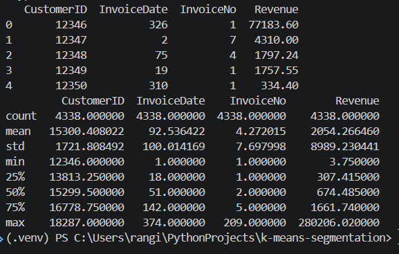
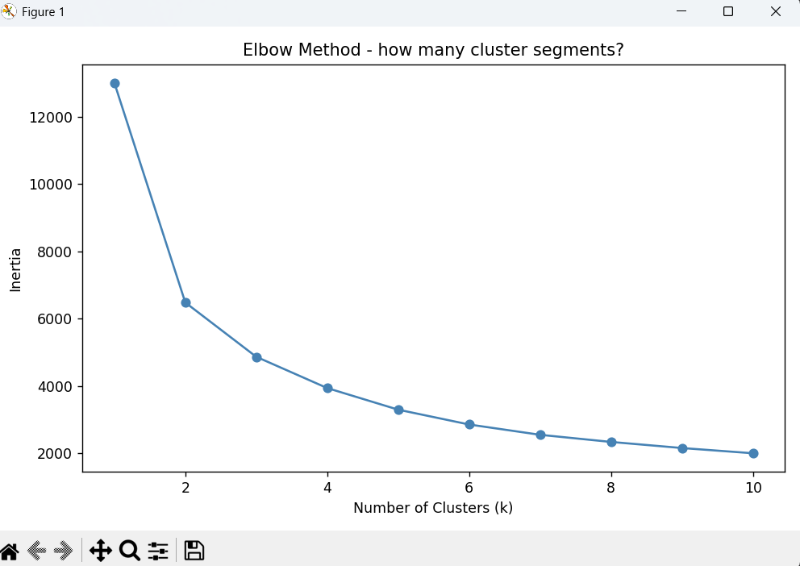

In VS Code -> Use command to create virtual environment -> activate virtual environment with PS Command .\venv\Scripts\activate

(.venv) PS C:\Users\rangi\PythonProjects\k-means-segmentation>

Once activated, any pip commands will install packages only into this environment.

Create requirements.txt file with the deps and run:
pip install -r requirements.txt

Add remote repo on GitHub
git remote add origin https://github.com/yashish/k-means-segmentation.git

# Verify that the remote is set correctly
git remote -v

# set the upstream branch and push local repo to GitHub
git push -u origin main

----------------------

A mini data science project.

Customer segmentation using K-Means clustering.

What we are building -  We're grouping customers by behavior using RFM:

Recency — days since last purchase
Frequency — total orders placed
Monetary — total spend

Three numbers per customer. That's your model input.

Dataset: Online Retail Data from UCI Machine Learning Repository
https://archive.ics.uci.edu/dataset/352/online+retail

The steps:

1. Clean the data — drop missing CustomerIDs, remove cancellations, create a Revenue column
2. Build RFM features — one row per customer, three columns
3. Scale the data — log-transform + standardize or your clusters will be meaningless
4. Find k — plot the elbow curve, pick k = 3 or 4
5. Run the model — fit K-Means, label your segments:

Champions — low recency, high spend
New customers — low recency, low spend
At risk — high recency, high spend
Lost — high recency, low spend

6. Write your insight — "23% of customers are At Risk. Time for a win-back campaign."

AFter execution of:

print(rfm.head())
print(rfm.describe())

# plot
